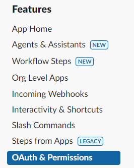
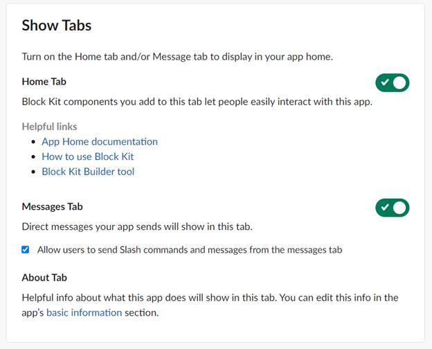
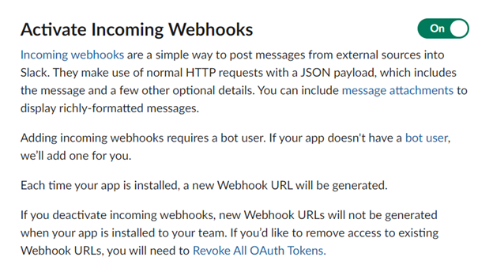
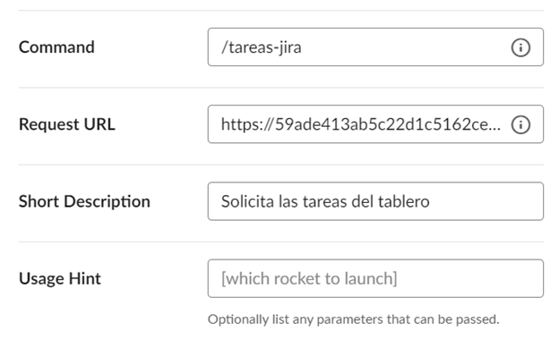
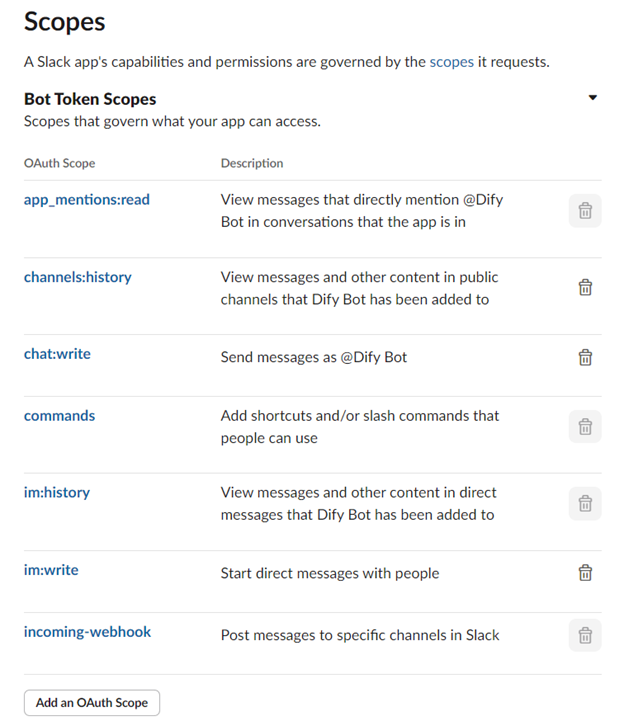
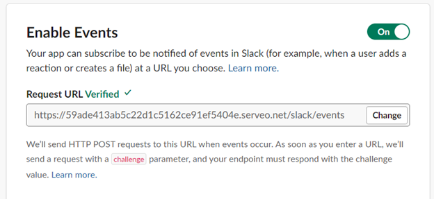
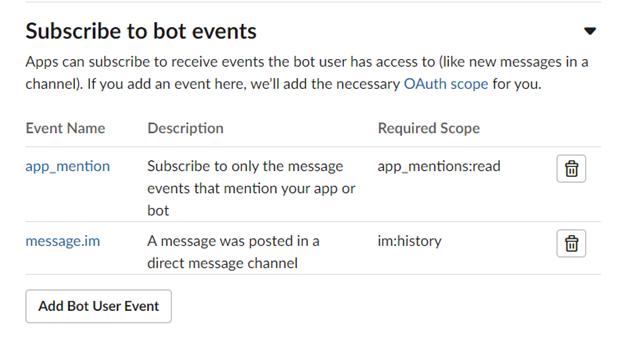

# Bot para Slack con Jira

Para usar el bot, el script que se ejecuta en local debe hacerse público. En las pruebas, se ha estado utilizando [Serveo](https://serveo.net/). El enlace generado es el que se usará para configurar los comandos y la suscripción a eventos.

La aplicación del bot se crea desde [Slack API](https://api.slack.com/)
## Configuración del archivo `.env`

- **Token de Dify.ai:** Se utiliza el token personal.
- **Credenciales de Jira:** Son las credenciales de Emiliano.
- **Slack Signing Secret:** Se encuentran en las secciones de _Home App_, _Incoming Webhooks_ y _OAuth and Permissions_ en la configuración de la app en Slack.

## Uso del bot en Slack

Para usar el modelo en el canal de Slack, se debe interactuar con `@Dify Bot`. Los comandos disponibles son:

- `/tareas-jira Proyecto: TAI Tareas: #`: En caso de ingresar una entrada diferente, el bot responderá indicando que se utilice el formato correcto.

## Pasos para configurar el bot

Para configurar el bot, me basé en el siguiente [tutorial de YouTube](https://www.youtube.com/watch?v=KJ5bFv-IRFM&list=PLzMcBGfZo4-kqyzTzJWCV6lyK-ZMYECDc).

### Crear una aplicación en Slack

1. Ir a la [API de Slack](https://api.slack.com/) y crear una nueva aplicación.
2. Configurar el nombre del bot y el espacio de trabajo donde se instalará.
3. En la sección de _Home App_, activar _Home App_ y la pestaña _Messages Tab_, además de marcar la opción para permitir enviar mensajes directos.

### Incoming Webhooks

Activar los _Incoming Webhooks_ para poder enviar mensajes a Slack, generando el webhook correspondiente que se utilizará en el archivo `.env`.

### Slash Commands

Crear el comando `/tareas-jira` para solicitar el tablero de Jira y recibirlo en Slack.

- **Request URL:** Usar el enlace generado por Serveo (o la herramienta que utilizada para hacer público el localhost) y agregar al final `/tareas-jira`.

### Scopes

Agregar los _Scopes_ necesarios para otorgar al bot los permisos requeridos para sus funcionalidades.

### Event Subscriptions

1. Agregar la URL pública del localhost (usando Serveo u otra herramienta), terminando con `/slack/events`.
2. Configurar los eventos a los que el bot se va a suscribir.

